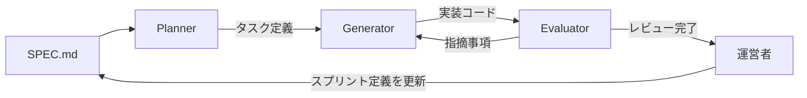

このブログは、人間1人とAI3人のチームで作った。

正確には、Claude Codeというツールの上に3つのAIエージェントを構築し、それぞれに役割を与えて開発を進めた。

Planner、Generator、Evaluator。

この3つが何をするのか、なぜそういう構成にしたのか、を書く。

---

## なぜ1人で作らなかったか

最初はシンプルにAIに指示を出して、返ってきたコードをそのまま使う形で進めていた。

でもすぐに限界が来た。

**AIは自分の出力を自分でレビューするのが苦手だ。**

「このコードで問題ないですか？」と聞くと、だいたい「問題ありません」と返ってくる。自分が書いたものを自分で否定するのは、AIも人間も難しい。

そこで介護現場のことを思い出した。

介護の現場でも、一人ですべてを判断することは少ない。ケアマネが計画を立て、介護士が実行し、看護師や管理者が確認する。それぞれが役割を持ち、互いにチェックし合うことで、ケアの質が保たれる。


ソフトウェア開発も同じではないかと思った。

そう考えて作ったのが、Planner / Generator / Evaluatorの3エージェント構成だ。

---

## 3つの役割

### Planner（計画者）

Plannerの仕事は、実装の前に「何を作るか」を明確にすることだ。

曖昧な要求をそのままGeneratorに渡すと、的外れな実装が返ってくる。だからPlannerが先に要件を整理し、タスクを分解し、実装方針を決める。

設計書を作るイメージに近い。

```
# .claude/agents/planner.md（抜粋）

あなたはPlannerです。
SPEC.mdに記載されたスプリント定義を読み込み、
実装タスクを具体的なステップに分解してください。
曖昧な要件は自己判断せず、明示的に質問してください。
```

### Generator（実装者）

GeneratorはPlannerの出力を受け取り、実際にコードを書く。

ここは純粋に実装に集中させる。設計の議論はしない。Plannerが決めたことを忠実に実装するだけ。

役割を分けることで、「考える」と「作る」が混在しなくなる。

```
# .claude/agents/generator.md（抜粋）

あなたはGeneratorです。
Plannerが出力したタスク定義に従い、コードを実装してください。
設計の変更提案はEvaluatorフェーズで行い、
このフェーズでは実装に専念してください。
```

### Evaluator（評価者）

Evaluatorが一番重要かもしれない。

Generatorが書いたコードを、別の視点からレビューする。バグの検出、設計上の問題、パフォーマンスの懸念、セキュリティリスク。Generatorが見落としたものを拾い上げる役割だ。

同じAIでも、「作る役割」と「評価する役割」を分けると、指摘の質が上がる。自分が書いたコードを自分でレビューする状態から脱却できる。

```
# .claude/agents/evaluator.md（抜粋）

あなたはEvaluatorです。
Generatorの実装を批判的な視点でレビューしてください。
「問題ありません」という結論を避け、
必ず改善点または確認事項を1つ以上挙げてください。
```

### 全体の流れ

3つのエージェントとSPEC.md、そして自分（運営者）がどう繋がっているかを図にすると、こうなる。



EvaluatorからGeneratorへの矢印がポイントだ。一発で「完了」にはならず、指摘があれば実装に戻る。このループがあることで、自分一人でレビューするより欠陥が拾われやすくなった。

---

## SPEC.mdがすべての起点

3エージェントを動かす上で、もう一つ重要なものがある。

**SPEC.md**だ。

SPEC.mdはスプリントの定義を書いたファイルで、プロジェクトの「単一の真実」として機能する。

```markdown
# Sprint 3: タグ機能の実装

## Goal
記事にタグを付与し、タグ別の一覧ページを生成する

## Scope
- Veliteのスキーマにtagsフィールドを追加
- /tags/[tag]の動的ルートを実装
- タグ一覧ページ（/tags）を実装

## Out of Scope
- タグのデザイン改善（Sprint 5以降）
- 検索との統合（Sprint 6以降）
```

Plannerはこれを読んで動く。GeneratorはPlannerの出力を元に動く。EvaluatorはGeneratorの出力を評価する。

SPEC.mdが曖昧だと、全体がブレる。逆にSPEC.mdが明確だと、3エージェントが驚くほどスムーズに動く。

---

## やってみて分かったこと

**単一AIとの最大の違いは、欠陥の検出率だ。**

1人のAIに「実装してレビューもして」と頼むと、自分の出力を肯定しがちになる。でもEvaluatorを分けると、Generatorが見落としたエッジケースやセキュリティ上の懸念を拾ってくることが増えた。

実際には、順調ではなかった。

CloudFront FunctionがAWS上に存在せず、個別記事がすべて403になる。GitHub ActionsのOIDC権限設定が不足してデプロイに失敗する。Terraform管理外のリソースが混ざり、構成が壊れる。

問題の発見は自分だったりEvaluatorだったりしたが、少なくとも複数の視点で確認する仕組みがなければ、もっと遠回りしていたと思う。

**もう一つは、スプリント駆動との相性が良いことだ。**

SPEC.mdでスコープを区切り、1スプリントずつ進める。このブログはSprint 0からSprint 9まで、合計10スプリントで完成した。

スプリントが小さいほど、Plannerの設計が正確になり、Generatorの実装がブレず、Evaluatorのレビューが鋭くなる。

---

## ディレクトリ構成

参考までに、実際のエージェント構成はこうなっている。

```
.claude/
└── agents/
    ├── planner.md
    ├── generator.md
    └── evaluator.md
SPEC.md
```

Claude Codeはこの`.claude/agents/`配下のファイルをエージェント定義として読み込む。プロンプトファイルをリポジトリに置いておくだけで、チームメンバー（AIも人間も）が同じ定義で動ける。

---

## 介護士がAI開発チームを作って思ったこと

正直、最初は「エージェントを作る」という発想自体がなかった。

AIに聞いて、返ってきたコードを貼る。それだけだと思っていた。

でも役割を分けることで、AIの出力の質が上がった。そして自分がどこに集中すればいいかも明確になった。

Plannerに設計を任せている間、自分はSPEC.mdを磨くことに集中できる。Generatorが実装している間、自分は次のスプリントを考えられる。Evaluatorがレビューしている間、自分はコーヒーを飲める。

介護現場でいえば、役割分担とチームプレーの話だ。1人で全部やろうとするより、役割を決めてチームで動く方が、絶対にいいものができる。それはAIチームでも同じだった。

[AWSの勉強を始めた時](/blog/2026-06-23-aws-saa-pass-as-caregiver)、私はVPNという言葉すら知らなかった。

そんな自分が今、AIに役割を与え、Terraformでインフラを管理し、GitHub Actionsで自動デプロイを回している。

正直、自分でも少し信じられない。

でも、このブログ自体がその証拠だと思う。

このAIチームは、ブログだけでなく実際に介護現場で使うツールを作るときにも同じ体制で動かした。

この時点では、まだブログは公開できていなかった。次に立ちはだかったのは、TerraformとGitHub Actionsによるデプロイパイプライン構築だった。

次回は、そのインフラ構築の話を書く（[介護士がTerraform + GitHub Actions + OIDCでブログのCI/CDを構築した話](/blog/2026-06-25-caregiver-built-cicd-with-terraform)）。