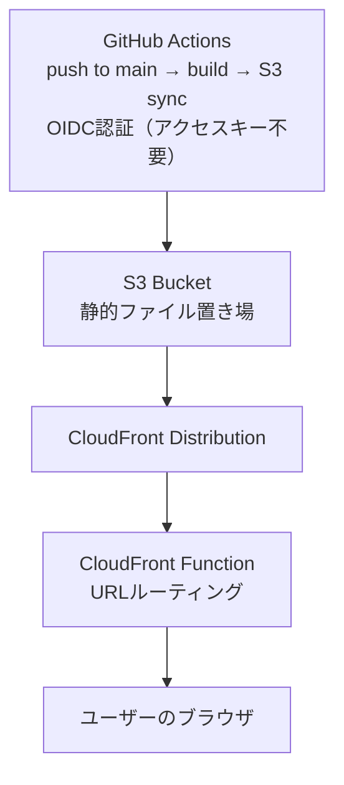

`git push`したら、本番に反映される。

それだけのことを実現するために、かなりの時間を使った。

この記事では、Next.jsの静的ブログをS3 + CloudFrontにデプロイするCI/CDパイプラインをTerraform + GitHub Actions OIDCで構築した話を書く。

介護士がインフラを組んだ記録として、詰まったところも含めて残しておく。


---

## 全体構成

まず完成形の構成を示す。



TerraformがAWSリソース全体を管理し、GitHub Actionsがビルドとデプロイを自動化する。

---

## Terraformで管理したリソース

### S3バケット

静的ファイルの置き場。CloudFrontからのみアクセスを許可し、パブリックアクセスはすべてブロックする。

```hcl
resource "aws_s3_bucket" "blog" {
  bucket = var.bucket_name
}

resource "aws_s3_bucket_public_access_block" "blog" {
  bucket = aws_s3_bucket.blog.id

  block_public_acls       = true
  block_public_policy     = true
  ignore_public_acls      = true
  restrict_public_buckets = true
}

resource "aws_s3_bucket_policy" "blog" {
  bucket = aws_s3_bucket.blog.id
  policy = jsonencode({
    Version = "2012-10-17"
    Statement = [
      {
        Sid    = "AllowCloudFrontAccess"
        Effect = "Allow"
        Principal = {
          Service = "cloudfront.amazonaws.com"
        }
        Action   = "s3:GetObject"
        Resource = "${aws_s3_bucket.blog.arn}/*"
        Condition = {
          StringEquals = {
            "AWS:SourceArn" = aws_cloudfront_distribution.blog.arn
          }
        }
      }
    ]
  })
}
```

### CloudFront Distribution

S3の前段に置いてキャッシュと高速配信を担う。OAC（Origin Access Control）でS3との接続を制御する。

```hcl
resource "aws_cloudfront_origin_access_control" "blog" {
  name                              = "blog-oac"
  origin_access_control_origin_type = "s3"
  signing_behavior                  = "always"
  signing_protocol                  = "sigv4"
}

resource "aws_cloudfront_distribution" "blog" {
  origin {
    domain_name              = aws_s3_bucket.blog.bucket_regional_domain_name
    origin_id                = "S3Origin"
    origin_access_control_id = aws_cloudfront_origin_access_control.blog.id
  }

  enabled             = true
  default_root_object = "index.html"

  default_cache_behavior {
    target_origin_id       = "S3Origin"
    viewer_protocol_policy = "redirect-to-https"
    allowed_methods        = ["GET", "HEAD"]
    cached_methods         = ["GET", "HEAD"]

    function_association {
      event_type   = "viewer-request"
      function_arn = aws_cloudfront_function.url_rewrite.arn
    }

    forwarded_values {
      query_string = false
      cookies {
        forward = "none"
      }
    }
  }

  restrictions {
    geo_restriction {
      restriction_type = "none"
    }
  }

  viewer_certificate {
    cloudfront_default_certificate = true
  }
}
```

### CloudFront Function

ここが一番ハマったポイントだ。後述するが、**ファイルを作るだけでは動かない。**

Next.jsの静的エクスポートでは、`/posts/hello`というURLは`/posts/hello.html`または`/posts/hello/index.html`として出力される。CloudFrontはデフォルトでこのマッピングを自動解決しないため、URLを書き換えるFunctionが必要になる。

```hcl
resource "aws_cloudfront_function" "url_rewrite" {
  name    = "url-rewrite"
  runtime = "cloudfront-js-2.0"
  publish = true
  code    = file("${path.module}/functions/url-rewrite.js")
}
```

```javascript
// functions/url-rewrite.js
async function handler(event) {
  const request = event.request;
  const uri = request.uri;

  // 拡張子がある場合はそのまま
  if (uri.match(/\.[a-zA-Z0-9]+$/)) {
    return request;
  }

  // トレイリングスラッシュがある場合はindex.htmlを追加
  if (uri.endsWith('/')) {
    request.uri += 'index.html';
    return request;
  }

  // それ以外は/index.htmlを追加
  request.uri += '/index.html';
  return request;
}
```

### GitHub Actions用OIDCプロバイダーとIAMロール

アクセスキーを使わずにGitHub ActionsからAWSを操作するための設定。

```hcl
resource "aws_iam_openid_connect_provider" "github" {
  url = "https://token.actions.githubusercontent.com"

  client_id_list = ["sts.amazonaws.com"]

  thumbprint_list = [
    "6938fd4d98bab03faadb97b34396831e3780aea1"
  ]
}

resource "aws_iam_role" "github_actions" {
  name = "github-actions-blog-deploy"

  assume_role_policy = jsonencode({
    Version = "2012-10-17"
    Statement = [
      {
        Effect = "Allow"
        Principal = {
          Federated = aws_iam_openid_connect_provider.github.arn
        }
        Action = "sts:AssumeRoleWithWebIdentity"
        Condition = {
          StringLike = {
            "token.actions.githubusercontent.com:sub" = "repo:${var.github_repo}:ref:refs/heads/main"
          }
          StringEquals = {
            "token.actions.githubusercontent.com:aud" = "sts.amazonaws.com"
          }
        }
      }
    ]
  })
}

resource "aws_iam_role_policy" "github_actions" {
  name = "blog-deploy-policy"
  role = aws_iam_role.github_actions.id

  policy = jsonencode({
    Version = "2012-10-17"
    Statement = [
      {
        Effect = "Allow"
        Action = [
          "s3:PutObject",
          "s3:DeleteObject",
          "s3:ListBucket"
        ]
        Resource = [
          aws_s3_bucket.blog.arn,
          "${aws_s3_bucket.blog.arn}/*"
        ]
      },
      {
        Effect   = "Allow"
        Action   = "cloudfront:CreateInvalidation"
        Resource = aws_cloudfront_distribution.blog.arn
      }
    ]
  })
}
```

---

## GitHub Actionsのワークフロー

mainブランチへのpushをトリガーに、ビルドとデプロイを自動実行する。

```yaml
# .github/workflows/deploy.yml
name: Deploy Blog

on:
  push:
    branches:
      - main

permissions:
  id-token: write
  contents: read

jobs:
  deploy:
    runs-on: ubuntu-latest

    steps:
      - uses: actions/checkout@v4

      - uses: actions/setup-node@v4
        with:
          node-version: '20'
          cache: 'npm'

      - name: Install dependencies
        run: npm ci

      - name: Build
        run: npm run build

      - name: Configure AWS credentials
        uses: aws-actions/configure-aws-credentials@v4
        with:
          role-to-assume: ${{ secrets.AWS_ROLE_ARN }}
          aws-region: ap-northeast-1

      - name: Sync to S3
        run: |
          aws s3 sync ./out s3://${{ secrets.S3_BUCKET_NAME }} \
            --delete \
            --cache-control "public, max-age=31536000, immutable"

      - name: Invalidate CloudFront cache
        run: |
          aws cloudfront create-invalidation \
            --distribution-id ${{ secrets.CLOUDFRONT_DISTRIBUTION_ID }} \
            --paths "/*"
```

OIDCを使うポイントは2つ。

1. `permissions`に`id-token: write`を必ず追加する
2. `configure-aws-credentials`で`role-to-assume`を指定する

この2つが揃わないと認証に失敗する。最初はここで詰まった。

---

## 詰まったところ

### OIDCのパーミッション設定漏れ

最初、`permissions`ブロックを書いていなかった。

エラーメッセージは`Error: Credentials could not be loaded`。最初は原因が分からなかったが、`id-token: write`がないとGitHub ActionsがOIDCトークンを発行できないことが分かった。

### CloudFront Functionが有効化されていなかった問題

これが一番時間を使った。

`terraform apply`したのに動かない。GitHub Actionsは成功しているのに個別記事だけ403になる。CloudFrontのキャッシュかと思って無効化しても直らない。S3のバケットポリシーを疑っても直らない。

JSファイルは存在する。Terraformのコードにも`aws_cloudfront_function`リソースは定義されている。

でも、**AWS上にFunctionが作成されていなかった。**

Terraformのコード上では定義していたつもりだったが、実際には`terraform apply`が正しく実行されておらず、AWS上にFunctionが存在しない状態だった。当然DistributionへのAssociationも行われていない。だからリクエストがFunctionを通らず、URLの書き換えが発生しないまま403を返し続けていた。

`terraform plan`で改めて確認すると、Functionが`create`されていないことが分かった。`terraform apply`を正しく実行し直してFunctionを作成、Distributionに関連付けることで解消した。

修正は`function_association`ブロックを正しく書き直すだけだった。でも原因特定に半日かかった。この話は次の記事で詳しく書く。

なお、この構成は[介護士がClaude CodeでAI開発チームを作った話](/blog/2026-06-24-caregiver-built-ai-team-with-claude-code)で紹介したPlanner・Generator・Evaluatorチームと一緒に構築した。私自身は要件整理・レビュー・検証・トラブルシューティングを担当した。CloudFront Functionの問題のように「何が起きているか分からない」局面では、EvaluatorにTerraformの差分を読ませて原因を絞り込んだ。全部を自分で理解しながら進めたわけではないが、実際に動く環境を作り、エラーを解消し、本番公開までたどり着いた経験は大きな学びになった。

---

## やってみて分かったこと

TerraformとGitHub Actionsを組み合わせると、インフラの状態がコードで管理できる。

「なんとなく動いている」状態から、「なぜ動いているか分かる」状態になった。

それは介護記録に似ていると思った。口頭で申し送りをするより、記録に残す方が、あとで読んだ人が状態を理解できる。インフラもコードに残すことで、未来の自分が読み返せる。

CloudFrontの403エラーで半日溶かした話は次の記事に書く。