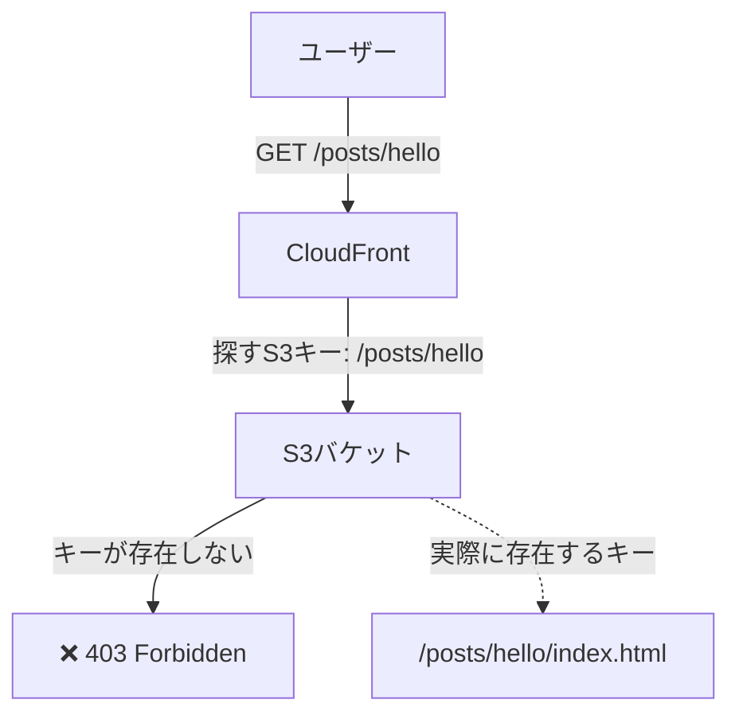
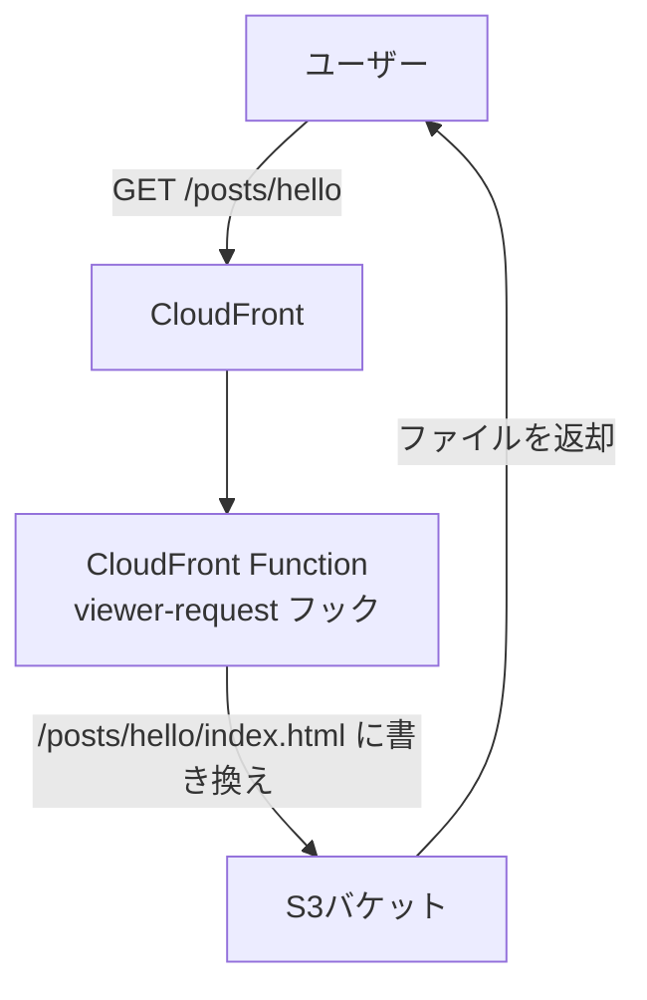
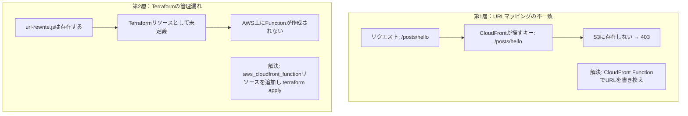

`terraform apply`は成功している。

GitHub Actionsも成功している。

S3にはファイルが存在する。

でも、個別記事のURLにアクセスすると**403**が返ってくる。

トップページは表示される。記事一覧も表示される。でも`/posts/hello`にアクセスすると403。なぜ。

[Terraform + GitHub Actionsでデプロイパイプラインを組んだ](/blog/2026-06-25-caregiver-built-cicd-with-terraform)直後にこの403に直面した。この記事は、その原因を突き止めるまでに半日かかった話だ。

---

## 環境

- フロントエンド: Next.js（静的エクスポート）
- ホスティング: S3 + CloudFront
- IaC: Terraform
- デプロイ: GitHub Actions

---

## 症状

デプロイ直後から、個別記事のURLだけ403になっていた。

```
https://example.cloudfront.net/          → 200 OK
https://example.cloudfront.net/posts/    → 200 OK
https://example.cloudfront.net/posts/hello → 403 Forbidden
```

トップページと一覧ページは問題ない。個別記事だけ403。

---

## 試したこと（全部外れ）

403だから、最初は権限の問題だと思った。S3バケットポリシー、OAC、CloudFrontのキャッシュ。全部疑った。でも原因はURLリライトだった。

### CloudFrontのキャッシュを疑った

まず思ったのはキャッシュだった。

```bash
aws cloudfront create-invalidation \
  --distribution-id XXXXXXXXXXXXXX \
  --paths "/*"
```

無効化しても直らない。

### S3のバケットポリシーを疑った

CloudFrontからS3へのアクセスが拒否されているのかと思い、バケットポリシーを確認した。OACの設定も確認した。問題なかった。

### S3上のファイルの存在を確認した

```bash
aws s3 ls s3://my-blog-bucket/posts/hello/
```

`hello/index.html`は存在する。ファイルはある。でも403になる。

### CloudFrontのエラーページ設定を疑った

カスタムエラーページの設定が悪さをしているのかと思い、確認した。問題なかった。

---

## 原因

1時間以上調べてようやく気づいた。

**Next.jsの静的エクスポートの仕組みの問題だった。**

Next.jsを`output: 'export'`で静的エクスポートすると、`/posts/hello`というURLは`/posts/hello/index.html`としてファイルが生成される。CloudFrontはデフォルトでは、`/posts/hello`というリクエストに対してS3の`/posts/hello`というキーを探しに行く。でもそんなキーは存在しない。



トップページが表示されていたのは、CloudFrontの`default_root_object`に`index.html`を指定していたから。でもサブパスにはその設定が効かない。

---

## 解決策：CloudFront FunctionでURLを書き換える

CloudFrontにはViewerリクエストをフックしてURLを書き換える仕組みがある。それがCloudFront Functionだ。

リクエストが来たタイミングで、`/posts/hello`を`/posts/hello/index.html`に書き換えてからS3に渡す。



```javascript
// functions/url-rewrite.js
async function handler(event) {
  const request = event.request;
  const uri = request.uri;

  // 拡張子がある場合はそのまま通す（CSS、JS、画像など）
  if (uri.match(/\.[a-zA-Z0-9]+$/)) {
    return request;
  }

  // トレイリングスラッシュがある場合はindex.htmlを追加
  if (uri.endsWith('/')) {
    request.uri += 'index.html';
    return request;
  }

  // それ以外は/index.htmlを追加
  request.uri += '/index.html';
  return request;
}
```

そしてTerraformでこのFunctionをCloudFront Distributionに関連付ける。

```hcl
resource "aws_cloudfront_function" "url_rewrite" {
  name    = "url-rewrite"
  runtime = "cloudfront-js-2.0"
  publish = true
  code    = file("${path.module}/functions/url-rewrite.js")
}

resource "aws_cloudfront_distribution" "blog" {
  # ... 省略 ...

  default_cache_behavior {
    # ... 省略 ...

    function_association {
      event_type   = "viewer-request"
      function_arn = aws_cloudfront_function.url_rewrite.arn
    }
  }
}
```

---

## 本当の詰まりポイント：Functionが存在しなかった

ここまで読んだ人は「それで解決したの？」と思うかもしれない。

違う。もう一段あった。

TerraformにはCloudFront Function用のコードファイル（`url-rewrite.js`）は置いていた。でも**Terraformリソースとして管理しておらず、AWS上にFunctionが作成されていなかった。さらにDistributionとの関連付けも存在しなかった。**

ファイルはある。でもTerraformが管理していないので、AWSには何も作られていない。

症状は変わらず403のまま。

```bash
# FunctionがAWS上に存在するか確認
aws cloudfront list-functions

# 出力にurl-rewriteが存在しない
```

`terraform plan`で確認すると、Functionが`create`されていないことが分かった。

```bash
terraform plan

# Plan: 1 to add, 1 to change, 0 to destroy.
# + aws_cloudfront_function.url_rewrite（作成されていなかった）
# ~ aws_cloudfront_distribution.blog（function_associationを追加）
```

`terraform apply`を実行してFunctionを作成し、Distributionに関連付けた。

```bash
terraform apply

# Apply complete! Resources: 1 added, 1 changed, 0 destroyed.
```

これで個別記事が表示されるようになった。

---

## まとめ：原因は2層あった

振り返ると、問題は2層に重なっていた。



**第1層：Next.jsの静的エクスポートとCloudFrontのURLマッピングの不一致**

`/posts/hello`というリクエストに対して、S3に`/posts/hello/index.html`が存在してもCloudFrontが見つけられない。CloudFront Functionでのリライトが必要。

**第2層：CloudFront FunctionがTerraformの管理対象になっていなかった**

URLリライト用のJavaScriptファイルは存在していたが、`aws_cloudfront_function`リソースとして定義されておらず、AWS上にはFunction自体が作成されていなかった。また、CloudFront Distributionとの関連付けも存在しなかった。

どちらか片方だけ解消しても直らない。両方を解消して初めて動いた。

---

## 教訓

- CloudFrontで静的サイトをホストするときは、最初からCloudFront FunctionでURLリライトを設定する
- Terraformでコードを書いたら、`terraform plan`で作成・更新されるリソースを確認する。意図したリソースが差分に出ているかを確認してから`terraform apply`する
- 403の原因はS3ポリシーだけではない。URLマッピングの問題も疑う

半日かかったが、おかげで以前よりも、Terraformのplan/applyの重要性とCloudFront Functionの役割を理解できた。

詰まった時間は無駄じゃなかった、と思うことにしている。

こうしてブログの土台が整ったところで、次は実際にAWS上で動くサービスを作り始めた。その話は[介護士がAWSでAI事故報告支援ツールを作った話](/blog/2026-06-27-caregiver-built-ai-accident-report-tool)に書く。