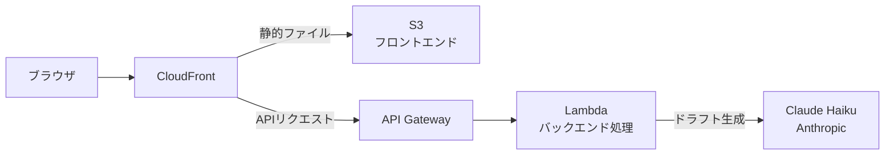

事故報告書を書くのが、正直しんどかった。

利用者さんが転倒した。ヒヤリハットがあった。そのたびに、同じような文章を一から書く。

「発生日時」「発生場所」「経緯」「対応内容」「今後の対策」。

書く内容は毎回似ている。でも毎回ゼロから書く。忙しい業務の合間に、疲れた頭で言葉を絞り出す。

しかも書き方は人によってバラバラだ。

ベテランスタッフが書いた報告書と、新人スタッフが書いた報告書では、情報の粒度も表現も全然違う。後で読み返したとき、何が起きたのか分かりにくいこともある。

「これ、もう少しなんとかならないのか。」

そう思い続けて数年が経った。

---

## なぜ作ったか

介護現場には、繰り返し発生する記録業務がある。

事故報告書もその一つだ。毎回ゼロから書くため時間がかかる。さらに書く人によって品質にばらつきがあり、夜勤明けや忙しい時間帯には抜け漏れも起きやすい。こうした課題を、AIで解決できないかと考えた。

以前、現場で効率化用のプロンプトを組んでAIを活用した経験がある。そのとき感じたのは、「AIはメールやイラスト生成などの日常的なツールだけではなく、現場でも十分使える」ということだった。

ただ、既存のツールを使うだけでは限界がある。現場のフローに合わせてカスタマイズするには、自分で作るしかない。

[AWSの勉強を終えた後](/blog/2026-06-23-aws-saa-pass-as-caregiver)、最初に作り始めたのがこのツールだった。

---

## 何ができるか

ツールの使い方はシンプルだ。

1. 事故の概要を入力する（いつ、どこで、何が起きたか）
2. 送信ボタンを押す
3. AIが報告書のドラフトを生成する

生成されるドラフトには、発生状況・対応内容・今後の対策が含まれる。スタッフはそれを確認・修正して、最終的な報告書として提出する。

百聞は一見にしかず。実際の動作を動画で確認してほしい。

  <iframe
    src="https://www.youtube.com/embed/RsQK21tP38E"
    title="AI事故報告支援ツール デモ動画"
    allow="accelerometer; autoplay; clipboard-write; encrypted-media; gyroscope; picture-in-picture"
    allowFullScreen
    className="absolute inset-0 h-full w-full"
    style={{border: "none"}}
  />

ポイントは、AIが「完成した報告書」を出すのではなく、「ドラフト」を出すことだ。

最終的な判断と責任は、あくまでスタッフが持つ。AIはその作業を助ける存在として設計している。

---

## なぜAIに任せきりにしないか

介護の記録には、法的な意味合いもある。

事故報告書は、施設の対応を証明する書類でもある。内容が不正確だったり、事実と異なったりすれば、それは大きな問題になる。

だからこそ、AIが出したドラフトをそのまま提出する設計にはしていない。

スタッフが内容を確認し、必要であれば修正する。AIはあくまで「たたき台」を作る役割だ。

これは介護現場の感覚に近い。

ケアプランはケアマネが作るが、現場のスタッフが確認して実施する。記録もAIが下書きを作るが、スタッフが確認して提出する。役割分担の話だ。

---

## 現在の状態と今後

現在は施設内運用を想定した認証をかけており、外部からの一般公開はしていない。

使用しているAIはClaude Haiku（Anthropic）。コストを抑えながら、事故報告書の生成に十分な精度が出ることを確認している。インフラはAWS上に構築しており、構成はこうなっている。

今後は、より多くの施設で使えるよう改善を続けていく予定だ。

もし介護・福祉業界でこのツールに興味を持った方がいれば、ぜひ連絡をいただきたい。

---

## 最後に

介護士としての経験が、このツールを作る原動力になった。

現場で感じた「これ、なんとかならないのか」という感覚。その感覚がなければ、このツールは生まれなかった。

AWSを学んだから作れたのではない。

介護士として現場を知っていたから、「何を作れば役に立つか」が分かった。その上でAWSやAIという技術を身につけたことで、実際に動く形へ落とし込めた。

現場を知る人が技術を持てば、現場に本当に必要なものを作れる。

私はその可能性を、これからも形にしていきたい。

正直、ここまで「Claude Codeがあれば介護士でも作れる」と書いてきたが、実際どこまで信じられるものなのか。その本音は次の記事に書いた。