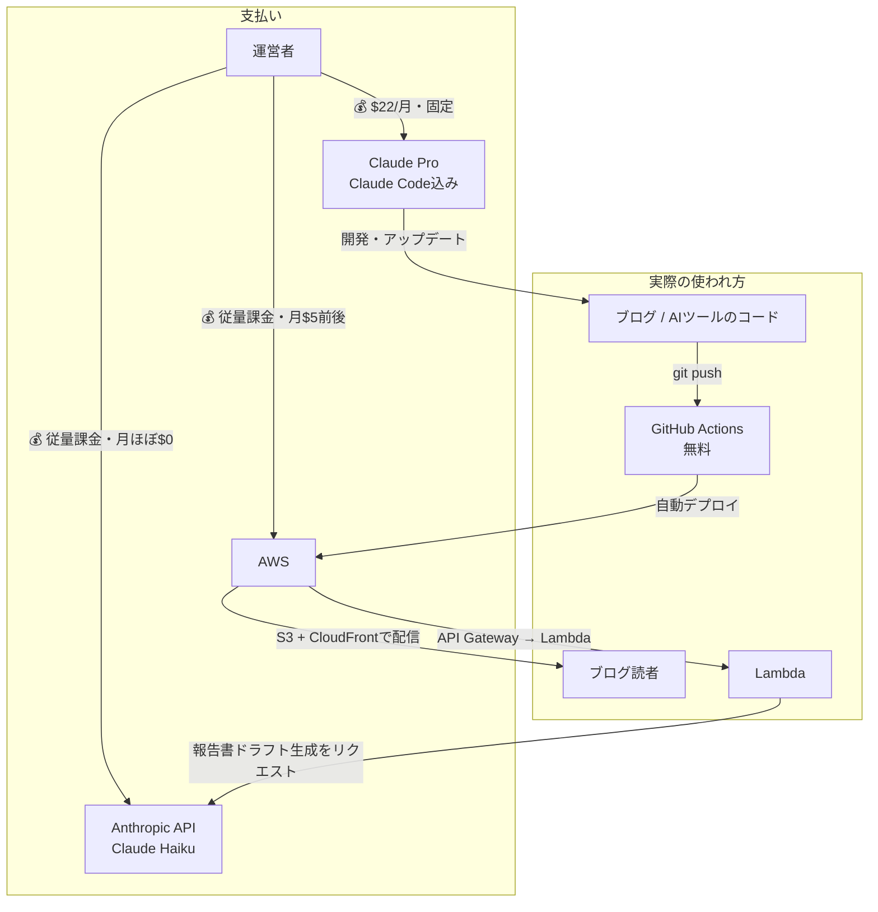

[前回の記事](/blog/2026-06-30-caregiver-honest-review-claude-code)でコストの内訳を次回書くと予告した。せっかくブログをやっているので、全部見せます。

「AIって実際いくらかかるの？」

「AWSって高いんじゃないの？」

「怖くて手が出せない」

そういう人に向けて、実際の画面と金額を全部公開します。

---

## 開発〜公開までにかかった費用

結論から言います。

**開発時に一度払ったもの**

| サービス | 費用 |
|---|---|
| Anthropic API クレジット | $5（約750円） |

**月々かかっているもの**

| サービス | 月額 |
|---|---|
| Claude Pro（Claude Code含む） | $22（約3,300円） |
| AWS | 無料枠内（0円） |
| **合計** | **約3,300円/月** |

一点補足しておきます。

Claude Proが必要なのは「開発・アップデートをするとき」だけです。ブログはGitHubからデプロイすれば動くので、更新しない月はClaude Codeを使いません。チャットボットもアプリ自体が動くのにClaude Codeは関係なく、開発やアップデートをするときだけ必要です。

「アプリを動かすためにClaude Proが必要」ではなく、「開発・アップデートするためにClaude Proが必要」という認識が正確です。

---

## どういう流れでお金を払っているか

文章だけだとどこで課金が発生しているか分かりにくいので、図にしました。

上半分が「誰が・何に・いくら払っているか」、下半分が「そのサービスが実際にどう使われているか」です。

ポイントは、**Claude Proへの支払いは開発フェーズだけ**で、**AWSとAnthropic APIへの支払いは公開後の運用フェーズで発生し続ける**という点です。ブログを読者が閲覧したり、AIツールが事故報告書のドラフトを生成したりするたびに、AWSとAnthropic APIの従量課金が動きます。逆にClaude Codeで新機能を作らない月は、Claude Proの$22だけが固定費として残ります（Claude Proそのものを解約すれば0円にできます）。

---

## Claude Proの請求画面

Claudeの設定 → 「請求」から確認できます。

6月18日に$22が請求されています。これがClaude ProとClaude Codeの月額料金です。

Claude Codeは別料金ではなく、Claude Proに含まれています。つまりClaude Codeを使うだけなら追加費用はゼロです。

---

## Anthropic APIの使用状況

APIの使用状況はAnthropic Consoleで確認できます。

今月の使用額は$0.00。クレジットが$4.73残っている状態です。

過去7日間のトークン量は2887。ほとんど使っていない月もあります。

APIはClaude Proとは別の課金です。私の場合、アプリのバックエンドでClaude Haikuを使っているため、APIも契約しています。ただし使用量が少ない月はほぼ0円で収まっています。

---

## AWSのコスト画面

AWS Billing ConsoleはAWSの請求をまとめて確認できる画面です。

当月の予想コストは$5.19。前月は$10.07でした。

前月が高かった理由があります。使い終わったリソースの消し残しです。

---

## AWSでやらかした話

AWSには怖いことが一つあります。

**使い終わったリソースを削除し忘れると、課金され続けます。**

私が実際にやらかしたのはこの3つです。

- **WAF（Web Application Firewall）**: 使わなくなったのに残っていた
- **AWS Config**: 設定確認のために有効にしたまま放置していた
- **Elastic IP**: EC2インスタンスに割り当てていないのに確保したままだった

これらの消し残しで前月は$10を超えました。気づいてすぐ削除したら、翌月は$5台に戻りました。

AWSは「作ったら終わり」ではなく、「作ったものを管理する」必要があります。

---

## AWSは初心者向けじゃないかもしれない

正直に言います。

**AWSはとっつきにくいです。**

設定項目が多く、消し残しによる意図しない課金リスクもあります。私がAWSを選んだのは「AWSを学ぶ」という目的があったからです。

「とりあえずWebサイトを公開したい」という人には、レンタルサーバーの方が向いているかもしれません。

私はWordPressやゲームサーバーをレンタルサーバーで開設した経験があります。その感覚で言うと、レンタルサーバーは管理画面が分かりやすく、余計な課金も起きにくい。初心者が最初に触るならそちらの方がストレスは少ないと思います。

ただ、「クラウドの仕組みを理解したい」「自分でインフラを組みたい」という目的があるなら、AWSは最高の勉強環境です。

---

## コスト確認の習慣

私がやっていることはシンプルです。

| 確認する場所 | 頻度 | 何が分かるか |
|---|---|---|
| AWS Billing Console | 週1回 | AWSの使用コスト、消し残しリソース |
| Anthropic Console | 週1回 | APIのトークン使用量と残高 |
| Claude Proの請求画面 | 月1回 | 月額料金の確認 |

難しいことは何もありません。画面を開いて数字を見るだけです。

「気づいたら何万円も請求されていた」という状況は、見ていないから起きます。見ていれば気づけます。気づければ対処できます。

コストが怖い人に伝えたいのは、「使えば安い」ではなく、**「見る習慣を作れば怖くなくなる」**ということです。

見えないから怖い。見えれば、ただの数字です。