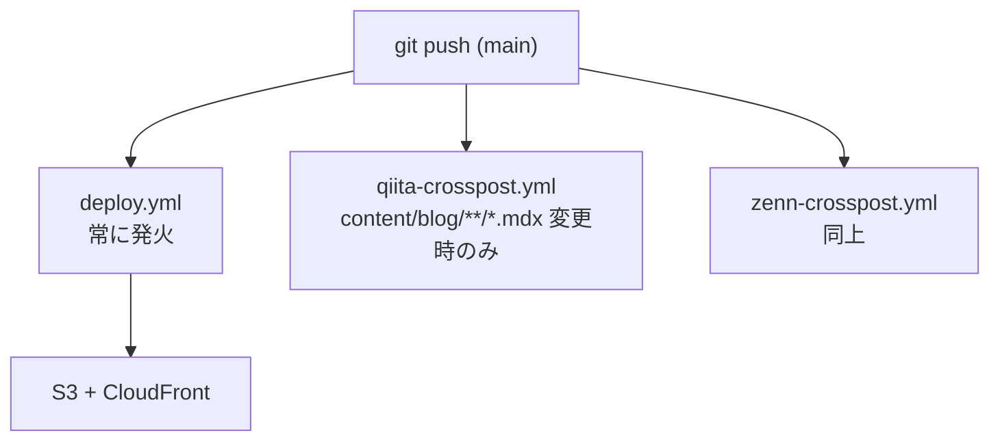
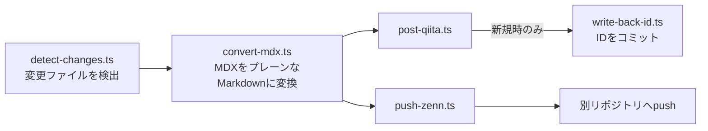

記事を書くたびに、Qiitaに貼って、Zennに貼って、自分のブログにも上げて。

それが面倒だった。

どうせ同じ内容を投稿するなら、`git push`一回で全部終わらせたい。

そう思って作ったのが、GitHub Actionsを使ったクロスポスト自動化の仕組みだ。

現在このブログの記事は、mainブランチへのpushをトリガーに自動でQiitaとZennに投稿される。この記事もそうだ。


---

## 全体構成

mainへのpushで3つのワークフローが並行して走る。



クロスポストのワークフローはMDXファイルが変更されたときだけ発火する。デプロイとは独立して動く。

このS3 + CloudFrontへの自動デプロイパイプライン自体は、以前TerraformとGitHub Actionsで構築したものだ。

そこに今回、クロスポスト用の2つのワークフローを追加した形になる。

各ワークフローの処理フローはこうなっている。



---

## QiitaとZennで仕組みが全然違う

実装してみて一番驚いたのはここだ。


**Qiitaはシンプル**

Qiita APIのトークンを取得してGitHub Secretsに登録するだけで動く。記事のIDをfrontmatterに書き戻すことで、次回以降は更新（PATCH）として処理される。

```typescript
// 新規ならPOST、qiita_idがあればPATCH
const method = qiitaId ? 'PATCH' : 'POST';
const url = qiitaId
  ? `https://qiita.com/api/v2/items/${qiitaId}`
  : 'https://qiita.com/api/v2/items';
```

**ZennはGitHubリポジトリが必要**

ZennはAPIを公開していない。代わりに、GitHubリポジトリと連携させることで記事を管理する仕組みになっている。

つまり「Zenn用の別リポジトリを作り、そこにMarkdownファイルをpushする」ことで投稿になる。

```typescript
// 一時クローンしたZennリポジトリにファイルを書き出してpush
await exec('git', ['clone', zennRepoUrl, tmpDir]);
await fs.writeFile(
  path.join(tmpDir, 'articles', `${slug}.md`),
  zennContent
);
await exec('git', ['push', 'origin', 'main'], { cwd: tmpDir });
```

最初はQiitaと同じ感覚でAPIを探していたが、存在しなかった。仕組みが根本的に違う。

---

## MDXのJSXコンポーネントはどうなるか

自分のブログはMDXで書いているため、JSXコンポーネントが含まれる。

例えば関連記事カード：

```mdx

```

これはQiita/Zennでは解釈できないため、クロスポスト時に除去する処理を入れている。

```typescript
function removeMdxComponents(content: string): string {
  return content.replace(/<[A-Z][a-zA-Z0-9]*(?:\s[^>]*)?\s*\/>/g, '');
}
```

**注意点**：この正規表現にヒットしたコンポーネントは、代替テキストもリンクも残さず丸ごと削除される。関連記事への導線がQiita/Zenn版では消えてしまう。

対応するなら、除去時にプレーンリンクに変換する処理を足す必要がある。

```typescript
// 改善案：コンポーネントをプレーンリンクに変換
function removeMdxComponents(content: string, posts: Post[]): string {
  return content.replace(
    /<RelatedPostCard\s+slug="([^"]+)"\s*\/>/g,
    (_, slug) => {
      const post = posts.find(p => p.slug === slug);
      return post ? `[${post.title}](${BASE_URL}/posts/${slug})` : '';
    }
  );
}
```

---

## 詰まりポイント5つ

### ① 新規記事公開直後の書き戻しコミットとの競合

新規記事を投稿するとQiitaからIDが返ってくる。そのIDをfrontmatterに書き戻すため、GitHub Actionsが自動でコミット&pushする。

このタイミングでローカルからpushすると競合する。

```
! [rejected] main -> main (fetch first)
```

新記事公開直後は少し時間を置くか、競合した場合は`git pull --rebase`で対応する。

### ② published: falseに戻してもQiita/Zennには反映されない

`detectChanges()`は「現在のfrontmatterが`published: true`」のものだけを対象にする。

つまり取り下げ（`published: false`に変更）のコミットはそもそも検出対象外になり、Qiita/Zennの記事はそのまま残り続ける。

取り下げたい場合は手動で対応する必要がある。

### ③ Zennのスラッグ文字数制限

ZennはスラッグがURLになるため、12〜50文字・`[a-z0-9_-]`のみというルールがある。

記事フォルダ名（=スラッグ）が`YYYY-MM-DD-`の11文字から始まるため、残り39文字以内に収める必要がある。超えた場合は自動で切り詰められるが、自サイトのURLとZennのURLの末尾がズレることがある。

```typescript
function validateSlug(slug: string): string {
  if (slug.length > 50) {
    // ハイフン境界で切り詰め
    const trimmed = slug.substring(0, 50).replace(/-[^-]*$/, '');
    console.warn(`slug truncated: ${slug} -> ${trimmed}`);
    return trimmed;
  }
  return slug;
}
```

### ④ 画像パスはVeliteのビルド結果に依存する

画像の絶対URL変換は`.velite/posts.json`の内容を参照している。そのためクロスポストのワークフロー内で`npx velite build`を実行する必要がある。

Veliteのビルドが失敗すると、画像パスの解決もできずワークフロー全体が止まる。

### ⑤ フロントマターの変換

QiitaとZennではfrontmatterの形式が違う。

```yaml
# 自サイト（MDX）
title: "記事タイトル"
tags: ["AWS", "介護"]
published: true

# Qiita用（変換後）
title: "記事タイトル"
tags: ["AWS", "介護"]
# + 本文末尾に転載リンクを追記

# Zenn用（変換後）
title: "記事タイトル"
emoji: "🛠️"
type: "tech"
topics: ["aws", "介護"]  # tagsをtopicsに変換
published: true
```

---

## まとめ

クロスポストの自動化で一番学んだのは、**QiitaとZennは仕組みが根本的に違う**ということだ。

QiitaはシンプルなREST API。ZennはGitHubリポジトリ連携。同じ「技術ブログプラットフォーム」でも、実装のアプローチが全然異なる。

詰まりポイントをまとめると：

| ポイント | 対応 |
|---|---|
| JSXコンポーネントの除去 | 正規表現で削除（プレーンリンクへの変換は今後対応） |
| 書き戻しコミットとの競合 | 新記事公開後は少し待つ |
| 取り下げの非反映 | 手動で対応 |
| Zennスラッグの文字数制限 | 50文字以内に収める |
| Velite依存 | ワークフロー内でビルドを実行 |

`git push`一回でブログ・Qiita・Zennの3箇所に投稿される状態は、一度作れば快適だ。同じ内容を手動で3回貼る作業から解放される。

この自動化も、Planner・Generator・Evaluatorの3エージェント体制で組んだ。役割を分けて動かす開発スタイルは、ブログ本体を作ったときから変わっていない。

[crosspost-retry-20260718]: <https://zenn.dev/faq#rate-limit> "re-send trigger"
[crosspost-retry-20260720]: <https://zenn.dev/faq#rate-limit> "re-send trigger"
[crosspost-retry-20260723]: <https://zenn.dev/faq#rate-limit> "re-send trigger"