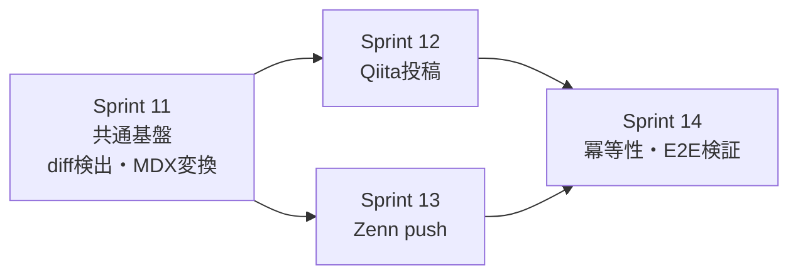

[前に書いた記事](/blog/2026-06-24-caregiver-built-ai-team-with-claude-code)で、Planner・Generator・Evaluatorという3エージェント体制と、その起点になる**SPEC.md**の話を書いた。

あれは「なぜSPEC.mdが必要か」という話だった。今回はその続きで、「実際どう運用しているか」を書く。

スプリントはどんな粒度で切っているか。SPEC.mdは1ファイルなのか、スプリントごとに分けているのか。そして、SPEC.mdをちゃんと書いていたつもりでも曖昧さが残っていて、実際に本番で失敗した話。

Sprint 0からSprint 14まで、このブログを作ってきた実際のSPEC.mdとコミット履歴を見ながら書く。

---

## スプリントの粒度：時間ではなく「検証できる単位」で切る

最初に結論を書く。

**1スプリント = 1日分、のような時間で区切ったことは一度もない。** 区切っているのは「ユーザーに見える挙動として、これが動けば完了と言い切れる単位」だ。

このブログのSPEC.mdには、今のところSprint 0からSprint 14まで15個のスプリントが並んでいる。

| Sprint | 内容 | 粒度の実態 |
|---|---|---|
| 0 | プロジェクト基盤とMDX表示パイプライン | インフラ的な土台。1機能ではなく「動く最小骨格」 |
| 1 | 記事一覧ページ | 1機能 |
| 2 | タグ機能 | 1機能 |
| 3 | GitHub ActionsによるS3+CloudFrontデプロイ | インフラ。UIとは独立して検証できる単位 |
| 4〜10 | ヘッダー、検索、フッター、サムネイル、目次、OGP、前後ナビ | それぞれ1機能=1スプリント |
| 11 | クロスポスト共通基盤（diff検出・MDX変換） | 1機能を分割した「土台」部分 |
| 12 | Qiita自動投稿 | 同じ機能の「プラットフォームA」部分 |
| 13 | Zenn自動push | 同じ機能の「プラットフォームB」部分 |
| 14 | 冪等性・エラー通知・E2E検証 | 同じ機能の「信頼性強化」部分 |

Sprint 4〜10を見ると分かる通り、基本は「1機能=1スプリント」で回している。タグ機能とデザイン改善を同じスプリントに詰め込んだりはしない。理由は単純で、**1スプリントに機能が2つ以上混ざると、Definition of Done（DoD）のチェック項目もどの機能の話か曖昧になり、Evaluatorのレビューの解像度が落ちる**からだ。

一方でSprint 11〜14は毛色が違う。「Qiita・Zennへの自動クロスポスト」という1つの機能を、あえて4つのスプリントに割った。



これは「大きい機能は時間で区切って分割する」のではなく、**技術的に独立して検証できる境界線で割った**結果だ。共通基盤（変換ロジック）が先に固まらないとQiita側もZenn側も試せない。QiitaとZennは仕組みが根本的に違う（前者はREST API、後者はGitHubリポジトリ連携）ので、同じスプリントで両方を実装すると、片方の不具合がもう片方のレビューに紛れ込む。だから土台→プラットフォームA→プラットフォームB→最後に信頼性強化、という順に割った。

粒度を決めるときに自分に問いかけているのは、結局この1つだけだ。

> このスプリントのDoDにチェックが全部つけば、「動く」と言い切れるか？

チェックがついても「たぶん動く」としか言えないなら、スプリントが大きすぎるか、境界の切り方が悪い。

---

## SPEC.mdは1ファイルで育てる

SPEC.mdはスプリントごとにファイルを分けていない。`SPEC.md`という1つのファイルに、Sprint 0からSprint 14までを`---`区切りで積み上げている。今は600行近くになった。

なぜ分けないか。理由は2つある。

**1つ目は、スプリント共通の前提を1箇所にまとめたいから。** SPEC.mdの冒頭には、こういうセクションがある。

```markdown
## 確定済み技術スタック（変更不可）
- Next.js（`output: 'export'` による静的書き出し）
- コンテンツ管理: Markdown/MDX + Velite
- ホスティング: S3 + CloudFront
- CI/CD: GitHub Actions

## コンテンツ構成（確定済み）
- 記事は `content/blog/{YYYY-MM-DD-slug}/index.mdx` に1記事1フォルダで配置
- フロントマター: `title`, `description`, `date`, `tags`, `published`
```

これをスプリントごとのファイルに分けると、Sprint 4を書くときも、Sprint 12を書くときも、この前提を毎回コピペするか、Plannerに「過去のファイルを全部読んで前提を拾ってきて」と頼むことになる。コピペすれば内容がズレて食い違うリスクが増えるし、全部読ませるならファイルを分けている意味がない。1ファイルなら、Plannerは常にこのファイルの先頭を読むだけで、確定事項を漏れなく引き継げる。

**2つ目は、過去のスプリントが後のスプリントの前提になることが普通にあるから。** 例えばSprint 7で追加した「記事サムネイル」フィールドは、Sprint 9のOGP画像生成の前提になっている。SPEC.mdのSprint 9には「本スプリントはSprint 7の完了を前提とする」と明記してある。1ファイルで時系列に並んでいれば、Plannerも自分もEvaluatorも、この依存関係をスクロールするだけで追える。

### 曖昧さを「保留」として明示する書き方

SPEC.mdを1ファイルで育てていく中で覚えたテクニックがもう1つある。**決められないことは、決めずに保留にすると明示する**ことだ。

Sprint 11〜13には、`### 要決定事項` という見出しがある。

```markdown
### 要決定事項
- `SITE_BASE_URL`: プレースホルダ `https://YOUR_CLOUDFRONT_DOMAIN`
- Zenn frontmatterの `emoji` のデフォルト値（例: `"📝"`）
- Zenn連携リポジトリ名: `{GitHub username}/zenn-articles`（仮、確定後に更新）
```

実際の値がまだ決まっていない項目を、無理に埋めて仕様を「完成させたふり」をするのではなく、プレースホルダを置いて先に進む。そして実装が終わったタイミングで、SPEC.mdのその部分を実際の値に書き戻す。

これをやらないと、決められない1項目のせいでスプリント全体の着手が止まる。逆に何も書かずに進めると、Generatorがその場の判断で適当な値を埋めてしまい、後から「なぜこの値なんだっけ」が分からなくなる。**保留は保留と書く**、これだけで曖昧さの扱いが安定する。

---

## それでも曖昧さは残る：本番で実際に起きた2つの失敗

粒度を意識して切って、前提も1ファイルにまとめて、保留事項も明示した。それでもSPEC.mdの曖昧さが原因で、Sprintを「完了」にした後に本番で不具合が出たことが2回ある。どちらもクロスポスト機能（Sprint 11〜14）の話だ。

### 失敗1：「絶対URLに変換する」の中身を詰めていなかった

Sprint 11のSPEC.mdには、こう書いてあった。

> 記事内の画像パス（`./image.png` 等の相対パス）がCloudFront絶対URLへ変換される

一見、これで十分に見える。実際、最初の実装はこの通りに動いた。

```typescript
// 最初の実装：スラッグから機械的にURLを組み立てる
return body.replace(
  /!\[([^\]]*)\]\(\.\/([^)]+)\)/g,
  (_match, alt, relPath) => ``
);
```

DoDのチェックも通った。ローカルで変換スクリプトを実行し、`` が `https://.../blog/{slug}/image.png` に変わることを確認して、Sprint 11は完了になった。

問題は、**このブログの画像配信の実態が、SPEC.mdに書いた前提と違っていた**ことだ。実際にはVeliteがビルド時に画像をハッシュ付きファイル名（`thumbnail-a61d6e.png` のような形）に変換し、`/static/` 配下に配置し直している。SPEC.mdの「相対パスをCloudFront絶対URLへ」という一文は、変換の**目的**は正しく書けていたが、**そこに至る実際の経路**（Veliteが裏で何をしているか）を検証しないまま書かれていた。

これが表面化したのは、実際にQiita・Zennへの投稿テストを行ったときだった。変換後のMarkdownをQiitaに投稿すると、画像が表示されない。SPEC.mdのDoDは「ローカルで変換スクリプトを実行して目視確認する」までしか要求していなかったので、Sprint 11の完了時点ではこのズレに気づけなかった。

修正は`.velite/posts.json`のビルド結果を読み、そこに書かれている実際の`/static/`パスをマッピングし直す形になった。

### 失敗2：DoDのシナリオが「1回のpush=1コミット」を前提にしていた

Sprint 14のDoDには、E2Eシナリオが4つ明記されていた。

- 新規記事のpush
- 既存記事の更新push
- `published: false` への変更push
- 対象外ファイルのみのpush

一見、網羅的に見える。実際、この4シナリオはすべて通った。

ところが、この4シナリオには共通する暗黙の前提があった。**「1回のpushにコミットが1つ」**という前提だ。diff検出の実装は、GitHub Actionsが渡す`GITHUB_BEFORE`（push前のSHA）と`GITHUB_SHA`（push後のSHA）の差分を見るが、リポジトリのチェックアウト設定は`fetch-depth: 2`にしてあった。「`HEAD~1`が取れれば十分」という考え方で、これは1コミットのpushでは正しく動く。

問題は、複数記事をまとめて1回のpushで反映するとき（例えば数記事のfrontmatterを一括修正してpushするようなケース）だ。この場合`GITHUB_BEFORE`は`HEAD~1`よりずっと前を指すことがあり、`fetch-depth: 2`ではその古いコミットの状態を取得できず、diff検出がエラーで落ちた。

```yaml
# 修正前：HEAD~1が取れれば十分という前提
fetch-depth: 2  # Needed so HEAD~1 is available for git diff

# 修正後：pushにまとまったコミット数を仮定しない
fetch-depth: 0  # Full history needed: GITHUB_BEFORE may be many commits behind on bulk pushes
```

これもSPEC.mdの書き方が甘かったというより、**DoDのシナリオが「代表的な正常系・異常系」は網羅していても、「pushの粒度」という軸が丸ごと抜けていた**ケースだ。4つのシナリオはどれも「1コミット1記事」を前提にしていて、それ以外の量的なバリエーションを誰も疑わなかった。

---

## 2つの失敗から学んだこと

この2つの失敗に共通するのは、どちらも**SPEC.mdの文章自体は「曖昧」に見えなかった**ことだ。「絶対URLへ変換する」も「4つのE2Eシナリオ」も、読んだ瞬間に「これは危ない」とは思わない。危ういのは、その文章が正しいと信じて疑わなかった裏の前提の方だった。

そこから、SPEC.mdの書き方・運用の仕方を2つ変えた。

**1つ目：DoDは「ローカルで再現できる確認」だけでなく、可能なら「実物に対する確認」まで書く。** 画像パスの失敗は、ローカルの変換スクリプトの出力を目視確認しただけでは気づけなかった。DoDに「実際にQiita/Zennへテスト投稿し、画像が表示されることを確認する」まで書いておけば、Sprint 11の時点で気づけていたはずだ。実際、Sprint 14はこの反省を踏まえて、最初からE2Eシナリオを本番APIに対して実行する前提でDoDを書いている。

**2つ目：DoDのシナリオを列挙するとき、「正常系・異常系」の軸だけでなく「量・タイミング」の軸も意識して洗い出す。** 1件だけでなく複数件、1回だけでなく連続、同時、といった軸だ。fetch-depthの失敗は、この軸がSPEC.mdの検討段階でまるごと抜けていたために起きた。今は新しいスプリントのDoDを書くとき、「これは1件だけの前提になっていないか」を一度自分に問い直すようにしている。

曖昧さを完全にゼロにすることは、たぶんできない。SPEC.mdをどれだけ書き込んでも、書いた本人が気づいていない前提は必ず残る。だから目指しているのは「曖昧さをゼロにする」ことではなく、**曖昧さが本番で牙を剥く前に、DoDの中で一度は牙を剥かせておく**ことだ。

---

## まとめ

- スプリントの粒度は時間ではなく「DoDにチェックが全部つけば動くと言い切れる単位」で切る。1機能=1スプリントが基本で、大きい機能は技術的な境界（共通基盤→A→B→信頼性強化）で割る。
- SPEC.mdは1ファイルで育てる。スプリント共通の前提を1箇所にまとめられ、過去のスプリントへの依存関係も同じファイル内で追える。決められないことは「要決定事項」として保留と明示し、プレースホルダで先に進む。
- それでも曖昧さは残る。このブログでは「絶対URLへの変換」という一文の裏にあったVeliteの実際の画像配信仕様と、「4つのE2Eシナリオ」の裏にあった「1push=1コミット」という暗黙の前提、この2つが本番で失敗を招いた。
- 対策は、DoDにローカル確認だけでなく実物への確認を含めること、そしてシナリオを洗い出すときに「量・タイミング」の軸を明示的に検討すること。

SPEC.md駆動のPlanner/Generator/Evaluator体制は、思想としては[前回書いた通り](/blog/2026-06-24-caregiver-built-ai-team-with-claude-code)うまく機能している。ただし、うまく機能するのは「良いSPEC.mdを書けたとき」に限る。良いSPEC.mdは一発では書けない。実際に動かして、失敗して、書き直す、そのループの回数がそのまま仕様の質になる。